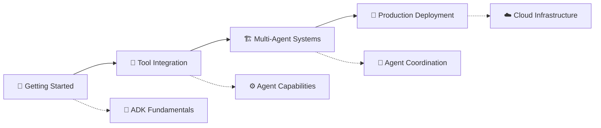

# 🚀 Deploy Multi-Agent Systems with Agent Development Kit (ADK) and Agent Engine

## 📚 Learning Path Overview

Master the complete journey from development to deployment of intelligent multi-agent systems with our comprehensive video series.

---

## 🎯 Training Modules

| 📖 Topic | 🎥 Video Tutorial | ⏱️ Focus Area | 🏷️ Level |
|---|-----|-----|-----|
| **Get started with Agent Development Kit (ADK)** | [▶️ Watch Tutorial](https://youtu.be/I3iVieBXtrs) | Foundation Setup | 🟢 Beginner |
| **Empower ADK agents with tools** | [▶️ Watch Tutorial](https://youtu.be/54KvY6hpvmQ) | Tool Integration | 🟡 Intermediate |
| **Build multi-agent systems with ADK** | [▶️ Watch Tutorial](https://youtu.be/qF-79d6ubps) | System Architecture | 🟠 Advanced |
| **Deploy ADK agents to Agent Engine** | [▶️ Watch Tutorial](https://youtu.be/bo0hcJPgm0g) | Production Deployment | 🔴 Expert |

---

## 🗺️ Learning Journey

## 📊 Course Progression

| Stage | Skills Acquired | Prerequisites |
|-------|----------------|---------------|
| 🟢 **Foundation** | • ADK basics • Environment setup • First agent creation | None |
| 🟡 **Enhancement** | • Tool integration • Agent capabilities • API connections | Stage 1 complete |
| 🟠 **Architecture** | • Multi-agent design • Communication patterns • System coordination | Stage 2 complete |
| 🔴 **Deployment** | • Production setup • Agent Engine integration • Monitoring & scaling | All previous stages |
---

`

